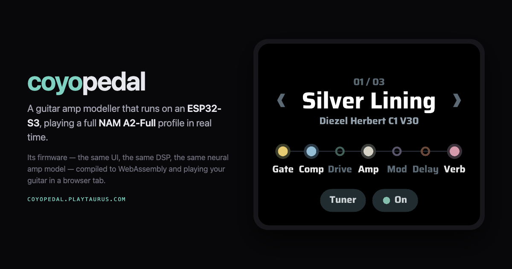

<p align="center">
  
</p>

# CoyoPedal

[](https://github.com/dashersw/coyopedal/actions/workflows/ci.yml)
[](LICENSE)

A standalone guitar amp and effects pedal built on the Waveshare
**ESP32-S3-Touch-AMOLED-2.06**. It runs full-size
[Neural Amp Modeler](https://www.neuralampmodeler.com/) A2 captures in real time
on the ESP32-S3, drives a class-compliant USB audio interface as a USB host, and
has a touchscreen UI written in TSX that is compiled to native C++ — there is no
JavaScript engine on the device.

The screen is one board's worth of it rather than the pedal itself: the same
firmware builds for a bare ESP32-S3 module with no panel at all, where the amp,
the effects and the presets are the same and the BOOT button is the footswitch.

**[Play it in your browser →](https://coyopedal.playtaurus.com/)** The same
firmware compiled to WebAssembly: the same UI, the same DSP, the same neural amp
model, playing your guitar through an audio interface. No board required to try
it, and nothing to install.

- **Full-size NAM A2 models at 48 kHz.** The 23-layer, eight-channel WaveNet runs
  in block floating point with hand-written Xtensa kernels, split across both
  cores and processed in 64-frame blocks.
- **Load your own captures.** Copy original `.nam` files to a microSD card, or
  point the browser build at a folder. The pedal parses, validates and prepares
  them on the device; there is no desktop converter.
- **An effects chain around the amp:** gate, compressor, chorus and drive before
  it; digital delay and stereo spring reverb after it.
- **Presets** for amp, controls and effects, stored on the pedal, with an
  on-screen keyboard for naming them.
- **A tuner** on the same screen, with the output muted while tuning.
- **Maintenance mode** with authenticated Wi-Fi OTA updates, remote diagnostics
  and BLE discovery. The radios are completely off while playing.

## Hardware

### Supported boards

| Board                                           | Alias       | Flash | What it has                                                                 | How you control it                                             |
| ----------------------------------------------- | ----------- | ----- | --------------------------------------------------------------------------- | -------------------------------------------------------------- |
| Waveshare ESP32-S3-Touch-AMOLED-2.06            | `amoled`    | 32 MB | ESP32-S3R8, 8 MB PSRAM, 410 × 502 AMOLED, touch, AXP2101 PMIC, microSD slot | Touchscreen; BOOT: tap to bypass, hold 1.5 s for maintenance   |
| ESP32-S3-DevKitC-1 N16R8, and bare S3R8 modules | `s3-devkit` | 16 MB | ESP32-S3R8, 8 MB PSRAM, no panel, no PMIC, no SD slot                       | BOOT: tap to engage or bypass, hold 1.5 s for maintenance mode |

The AMOLED board is the reference. It is what the factory presets, the browser
build and the screenshots are made against, and the panel-specific parts of the
firmware exist for it. A board with no screen runs the same amp through the same
DSP at the same 48 kHz — measured on the devkit at 91% and 94% of the 1,333 µs
block budget across the two cores, with no missed deadlines — and is configured
over the maintenance API instead of by hand.

What a board has to bring either way: an ESP32-S3 with **8 MB of PSRAM**, because
that is where the A2 model lives, and a USB port the chip can drive as a host. A
bare module has no PMIC and no battery path, so unlike the AMOLED it does not
feed the host port itself; the interface needs power from your own supply.

### Everything else

| Part        | Notes                                                                                     |
| ----------- | ----------------------------------------------------------------------------------------- |
| Audio       | A USB Audio Class 2 interface on the board's USB port, which runs as a USB host at 48 kHz |
| Storage     | Optional microSD card, on a board that has a slot, for your own captures                  |
| Tested with | XTONE Pro and IK Multimedia iRig HD X; iRig HD 2 through a dedicated UAC1 profile         |

The interface is discovered from its USB descriptors, so any interface that
exposes a 48 kHz UAC2 input and output should work. See
[USB audio](docs/USB_AUDIO.md) for the formats and limits.

## Using the pedal

The home screen shows the chain in signal order. Tap a block to turn it on or
off, or hold it to edit it: drag a slider to change a value, and use ‹ › to page
through the controls. Hold the **Amp** block to open the capture browser, which
shows the factory captures, the imported ones and the SD card's own folders. The
switch at the top right bypasses the whole pedal, and **Tuner** opens the tuner.

Tap the preset name to switch, save, rename, delete or create presets. A new
preset starts from the current sound.

On every board, BOOT works as a footswitch: a short press engages or bypasses
the pedal, and holding it switches between audio and maintenance mode. The
switch starts the moment the hold reaches 1.5 seconds, so the screen tells you
when you can let go. Short presses do nothing in maintenance mode.
On a board with no screen, presets, captures and the rest of the controls are
reached from maintenance mode with `tools/esp32/amoled_remote.py`. The pedal
boots engaged with the remembered preset, or the first preset, **Silver Lining**
(clean), when no selection has been saved.

### Your own captures

Supported models are **48 kHz, eight-channel NAM A2 ("A2-Full") WaveNets**,
including a matching member of a `SlimmableContainer`. Other architectures,
sample rates and layer shapes are rejected with an error. Prepared `.namb` files
are accepted as well.

Format a card as FAT and put `.nam` or `.namb` files anywhere under a `nam`
folder at its root, in whatever folders you like (up to six levels deep); the
browser shows that tree as it is, and a capture is named after its file. File
names must fit in 127 bytes and files in 2 MiB. Insert the card before powering
on, then pick the capture from the **Amp** browser.

The first time a capture is selected, audio pauses while the pedal prepares it.
This can take tens of seconds. When the card is writable, the pedal stores a
verified `.s3cache` file next to the original, so later loads are fast. The
original file is never modified.

The full VoLum library is published in the
[VoLum repository](https://github.com/guitarlum/VoLum/tree/main/rigs), and this
copies it to a mounted card as `/nam/VoLum/<amp>/`:

```bash
python3 tools/fetch_volum.py /Volumes/SDCARD
```

### The same captures in a browser

[coyopedal.playtaurus.com](https://coyopedal.playtaurus.com/) runs the firmware
itself, and it has no card slot, so it asks for a folder instead and answers the
firmware's SD calls out of it. The captures show up under **SD card** in the
pedal's own amp browser with the same names and the same ids they would have on
the card, an original `.nam` is prepared with the same tuner and cached beside
the file as `.s3cache` exactly as the board caches it, and presets are mirrored
into the folder as `coyopedal-presets.json` — the same document
`assets/presets.json` is, which you can open in a text editor, keep in a repo or
drop onto a card. Fill a folder in the browser, copy it to a card, and the board
reads it without preparing anything again.

Chrome and Edge write back to the folder; Safari and Firefox will only let a
page read one, so there the writes are kept in the browser's own storage.

## Building

### Requirements

- Git and Node.js 22.13 or newer
- Python 3 with Pillow and fontTools, used to rasterize the UI font
- A C++20 compiler and CMake, for the host tests
- The [Emscripten SDK](https://emscripten.org/) on `PATH`, for the web build only

The Gea CLI installs everything else, including ESP-IDF.

### Setup

1. Install the Gea CLI:

   ```bash
   npm i -g @geastack/cli
   ```

2. Install ESP-IDF 6.0.2 and its ESP32-S3 toolchain. It goes to `~/esp/esp-idf`;
   an existing install under `~/esp` or `~/esp32`, or at `IDF_PATH`, is found
   automatically.

   ```bash
   gea setup --esp-idf
   ```

3. Clone the repository and install its dependencies:

   ```bash
   git clone git@github.com:dashersw/coyopedal.git
   cd coyopedal
   npm ci
   ```

4. Connect the board over USB and register it:

   ```bash
   gea setup
   ```

   Choose **Known supported board**, then **Waveshare ESP32-S3 Touch AMOLED
   2.06**, and keep the alias `amoled`: the npm scripts use it. Select the
   detected USB device. The CLI identifies the board by its USB serial number,
   so it does not matter which port it shows up on. The OTA host is optional.

   For a board without a screen, see [Another board](#another-board) below; the
   rest of this section is the same.

5. Check the toolchain and the board:

   ```bash
   gea doctor
   ```

### Build and flash

```bash
gea build --board amoled
```

The firmware image is written to **`build/pedalboard.bin`**. The ESP-IDF build
tree stays in `.gea/build/`; you never need to open it.

The first flash has to go over USB, because it writes the partition table and
the factory data as well as the firmware:

```bash
gea flash --board amoled
```

Add `--dry-run` to see what would be written without flashing.
`npm run build:firmware` and `npm run flash:firmware` run the same two commands.
`--board s3-devkit` builds the same firmware for the headless board; the npm
scripts are the `amoled` shorthand.

On the AMOLED the flash is laid out as two 8 MB OTA slots, a factory-model
partition, a factory-preset partition and a partition for imported models. Saved
presets live in NVS, which flashing does not erase. A board with a different
flash size gets its own layout — see below.

### Another board

The firmware does not carry a list of boards. It asks the target definition what
the hardware has and compiles out whatever is absent, and two questions decide
almost everything.

**Is there a screen?** A target definition with neither a `chips.display` nor a
`canvas` means the board has no display at all, and the build gets
`GEA_EMBEDDED_NO_DISPLAY=1`: no framebuffers, no app tree, no frame scheduler,
no runtime task. That is about 1 MB of image and 1.25 MB of PSRAM a panel board
spends and this one never allocates. Note that a `canvas` without a panel is a
different thing — an offscreen surface that still renders, for screenshots and
OTA previews — so it is the absence of _both_ that means "no display". Do not
give a headless board an empty canvas.

**Is there a PMIC?** A definition that declares no power chip builds with
`GEA_BOARD_HAS_POWER=0`, and `src/native/drivers/power.cpp` compiles to a no-op
rather than failing to link against an AXP2101 that is not on the board.

To bring a new board up:

1. Pick or write its target definition in `@geastack/targets`. The devkit's is
   `targets/esp32-s3-devkit-n16r8.json`.
2. Register an alias for it with `gea setup`, or by hand in `.gea/boards.json`:
   the target id, the adapter (`esp32-idf`), the board's USB serial number, and
   `flashSize` when it is not 32 MB.
3. If the flash size differs from the AMOLED's, add that board's partition
   layout under `gea.targets.esp32.partitionsByTarget` in `package.json`, keyed
   by target id. The default `gea.targets.esp32.partitions` stays the 32 MB one,
   and a board without an entry of its own uses it.
4. `gea flash --board <alias> --monitor`.

One rule worth knowing when a board misbehaves at compile time: the app's own
`gea.defines` win over the board's. The pedal declares its display dimensions,
so a board that also declares a canvas size does not get to redefine them.

### Checks and tests

```bash
npm test      # USB descriptors, effects, presets and the prepared NAM model
npm run check # lint, TypeScript and formatting
```

[GitHub Actions](.github/workflows/ci.yml) runs both on every push and pull
request, and builds the firmware image and the web module as well. A runner has
no board, so the firmware job stops at the image — which is still the thing
worth having, because the amp graph, the panel and the drivers only meet at the
link step.

### The two browser builds

`npm run dev` is a DOM preview: the same TSX recompiled onto the web framework
and laid out by the browser. It is quick to iterate on, and it drifts from the
board exactly where you would want to trust it.

The deployed page is the other one. geatsc lowers the same TSX to C++ and emcc
links it with the same Gea layout and paint engine the firmware runs, so what
the page shows is what the panel shows:

```bash
npm run build:web-wasm
npm run serve:web
```

Serving it locally matters: the audio graph runs in an AudioWorklet over shared
memory, and a browser only hands out `SharedArrayBuffer` to a
cross-origin-isolated document, which is what `scripts/serve-web.mjs` and the
`web/_headers` file arrange.

A push to `main` publishes it. GitHub Actions builds the module and uploads the
site to the R2 bucket it is served from, so the page and the module it names are
always stamped and uploaded together. That workflow runs `scripts/deploy-web.sh`,
which stages `build/site` and uploads it; run it yourself to publish without a
push, and it wants `CLOUDFLARE_ACCOUNT_ID` and `CLOUDFLARE_API_TOKEN` in the
environment or in a `.env` the repository never tracks. `--stage` stops after
staging.

That token is an R2 API token with Object Read & Write on this one bucket and
nothing else. The upload goes over R2's S3 API rather than through Wrangler,
because Wrangler's `r2 object` commands use a REST endpoint that accepts only an
account-wide R2 Admin token and answers 403 to a token scoped this narrowly. The
token is the only secret needed: `scripts/r2-credentials.sh` derives the S3 key
pair from it.

The bucket is served through a custom domain, and the two cross-origin isolation
headers in `web/_headers` are set by a response header transform rule on the
zone: R2 serves only the headers an object carries as metadata, and those two
are not among them. Cache-Control is per-object and the script sets it.

## Maintenance mode and OTA updates

Maintenance mode unloads the audio graph and starts Wi-Fi and BLE. Enter it by
tapping the preset name, then **Setup**, then **Maintenance mode**, or with the
board's BOOT button — hold it until the screen says "Please wait", about 1.5
seconds, on either board. Hold it again, or choose **Return to pedalboard**, to
reboot into audio mode with the radios off. The pedal always starts in audio
mode, unless the previous boot crashed.

Wi-Fi credentials and the authentication token are compiled into the firmware
from `src/native/services/remote_config.h`, which is gitignored. Generate it
before building:

```bash
python3 tools/esp32/configure_remote.py --mode ap
```

`--mode ap` makes the pedal host its own access point at `192.168.4.1`.
`--mode station --ssid YOUR_WIFI` joins an existing network instead.
[`remote_config.h.example`](src/native/services/remote_config.h.example) shows
the generated format.

With the pedal in maintenance mode, `tools/esp32/amoled_remote.py` finds it,
reads its logs and updates it:

```bash
python3 tools/esp32/amoled_remote.py discover
```

```bash
python3 tools/esp32/amoled_remote.py --host PEDAL_IP ota
```

`ota` uploads `build/pedalboard.bin` unless you pass another image. After an OTA
update started from maintenance mode, the pedal boots the new image in audio
mode once, then returns to maintenance mode so you can check the logs. Run the
script with `--help` to see the diagnostic commands.

## Repository layout

```text
src/
  ui/          Touchscreen app (TSX, CSS, stores) for the device and the browser
  preview/     Browser adapter with a simulated pedal
  audio/       Effects, tuner and the per-block audio processor
    nam/       NAM A2 engine and its ESP32-S3 assembly kernels
  native/      Firmware
    main/         Boot, mode selection and audio graph lifecycle
    drivers/      USB audio host, flash storage, power
    audio/        Board-side DSP controls and PCM packing
    storage/      Model catalogue, SD import, .nam parsing, presets
    services/     Maintenance Wi-Fi, OTA, BLE discovery
    ui/           Bridge between the UI and the audio controls
    nam_banks/    Fixed-address allocator for the model's SRAM banks
    diagnostics/  Heap census
web/           The page that hosts the WASM build, and its bridge to the browser
assets/        Factory captures, capture library index, presets, fonts
scripts/       Build, deploy, test, format and preview helpers
tools/         Asset packers and the maintenance client
tests/         Host tests
third_party/   Vendored ESP-IDF USB host and cJSON
docs/          Architecture, memory layout and USB audio notes
```

Start with [docs/ARCHITECTURE.md](docs/ARCHITECTURE.md) for how the pieces fit
together, and [docs/MEMORY.md](docs/MEMORY.md) before changing anything that
allocates memory or places code.

## Factory captures

The firmware ships with two captures from
[VoLum](https://github.com/guitarlum/VoLum) by Lum: **Diezel Herbert, channel 1,
V30 cabinet** and **Ampete One, channel 4, V30 cabinet**. They are distributed
under the MIT License; see [THIRD_PARTY_NOTICES.md](THIRD_PARTY_NOTICES.md).

## Contributing

Issues and pull requests are welcome.
[CONTRIBUTING.md](CONTRIBUTING.md) covers the checks, the formatting rules and
the handful of things about this codebase that are easy to get wrong — the
firmware is a Gea app, so everything the native build needs is declared in
`package.json` rather than in a CMake file of its own.

## License

This project is licensed under the [GNU General Public License v3.0](LICENSE).
Third-party components keep their own licenses, and the firmware carries one
additional permission for the Espressif binary components it links; see
[NOTICE.md](NOTICE.md) and [THIRD_PARTY_NOTICES.md](THIRD_PARTY_NOTICES.md).
